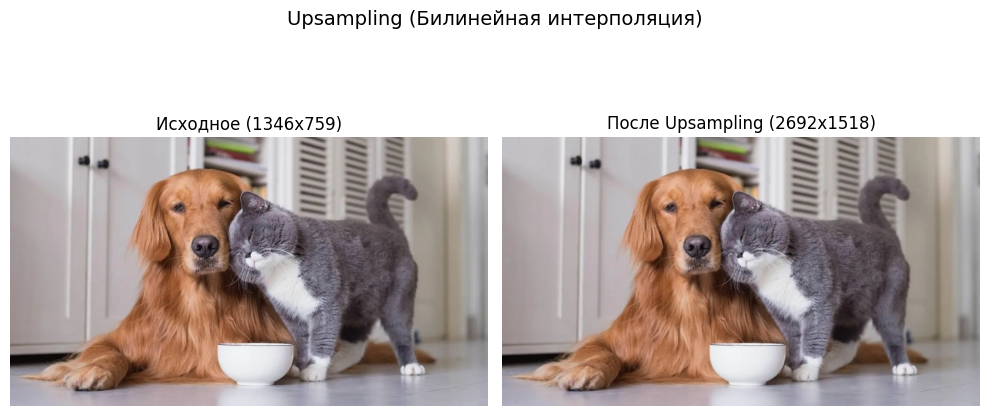
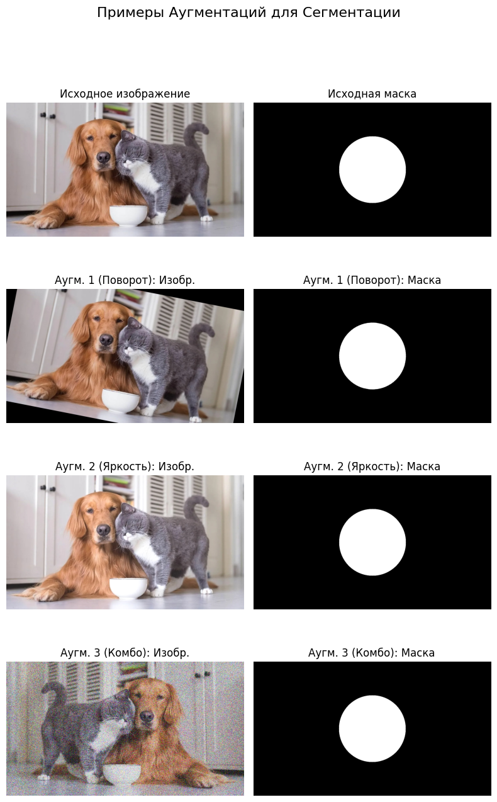

# Отчет: Сегментация изображений

## Введение

Работа посвящена изучению и демонстрации основных этапов для задач сегментации: Upsampling (увеличение разрешения) и аугментации данных. Также кратко описана концепция обучения модели сегментации.

## 1. Upsampling (Увеличение разрешения)

Для демонстрации Upsampling был использован метод **билинейной интерполяции** из библиотеки OpenCV (`cv2.resize`).

Тестовое изображение `test_image.jpg` было загружено и его разрешение увеличено в 2 раза.

**Результат:**

*Комментарий: Изображение успешно увеличено.*

Метод Upsampling продемонстрирован.

## 2. Обучение модели (Концепция)

*Примечание: Обучение модели не реализовывалось, описан только общий подход.*

Обучение модели сегментации (например, U-Net или YOLOv8-Seg) требует подготовленного датасета (пары изображение + маска), выбора функции потерь (например, Dice Loss) и метрик (IoU, Dice Score), настройки параметров (эпохи, батч) и использования предобученных весов для ускорения сходимости. После обучения модель тестируется на отложенной выборке.

## 3. Аугментации для Сегментации

Для демонстрации аугментаций использовалась библиотека `albumentations`. Были применены следующие трансформации к тестовому изображению и созданной для него маске:

1.  **Поворот (`A.Rotate`):** Применен к изображению и маске.
2.  **Яркость/Контраст (`A.RandomBrightnessContrast`):** Применен только к изображению.
3.  **Комбинация (Отражение `A.HorizontalFlip` + Шум `A.GaussNoise`):** Отражение применено к обоим, шум - только к изображению.

**Результат:**

*Комментарий: Аугментации корректно применились к изображению и маске с учетом специфики задачи сегментации.*

Аугментации продемонстрированы.

## Выводы

В ходе работы были успешно реализованы и продемонстрированы:
* Техника Upsampling для увеличения разрешения изображения.
* Примеры аугментаций для данных сегментации с использованием `albumentations`.
* Кратко описана концепция обучения модели сегментации.