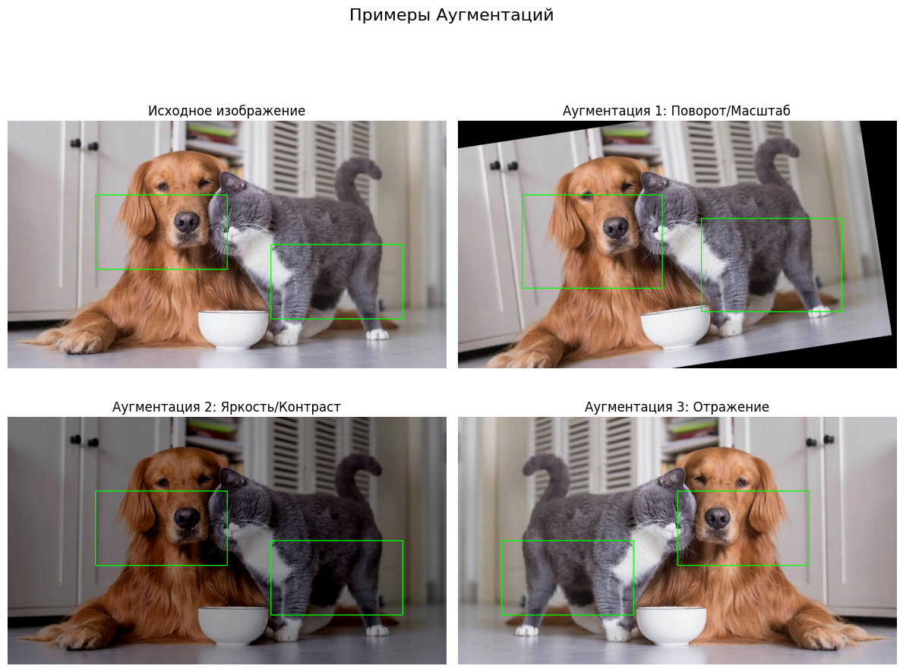

# Отчет: Детектирование объектов

## Введение

Работа посвящена изучению и демонстрации ключевых этапов в задачах детектирования объектов: реализации Non-Maximum Suppression (NMS) и аугментации данных. Также кратко описана концепция дообучения модели детектирования.

## 1. Non-Maximum Suppression (NMS)

Non-Maximum Suppression (NMS) — это алгоритм, используемый для отсеивания избыточных (сильно пересекающихся) ограничивающих рамок (bounding boxes) и выбора наиболее релевантных.

В рамках задания NMS был реализован на Python. Функция принимает список обнаруженных рамок (с координатами и уверенностью) и порог пересечения (IoU).
Алгоритм включает:
1.  Сортировку рамок по уверенности.
2.  Итеративное удаление рамок, у которых IoU с выбранной рамкой (с наивысшей уверенностью) превышает заданный порог.

Тестирование проводилось на синтетическом наборе из нескольких пересекающихся рамок.

**Результат Тестирования:**

Результаты работы NMS (исходные рамки и рамки после применения алгоритма) выводятся в консоль при выполнении скрипта. Пример вывода:

```
Исходные боксы:
[50, 50, 150, 150, 0.95]
[60, 60, 160, 160, 0.9]
...
Боксы после NMS (порог IoU = 0.5):
[50, 50, 150, 150, 0.95]
[210, 210, 310, 310, 0.88]
...
```
*Комментарий: Алгоритм корректно отфильтровывает избыточные рамки, оставляя наиболее уверенные и не сильно пересекающиеся.*

Алгоритм NMS успешно реализован и протестирован.

## 2. Дообучение модели детекции (Концепция)

*Примечание: Дообучение модели не реализовывалось, описан только общий подход.*

Дообучение модели детектирования объектов (например, YOLOv8 от `ultralytics`) включает следующие этапы:
1.  **Подготовка датасета:** Создание набора данных (изображения и соответствующие им аннотации рамок и классов) в формате, требуемом моделью (например, формат YOLO).
2.  **Настройка обучения:** Выбор предобученной модели, определение параметров обучения (количество эпох, размер батча, скорость обучения), функций потерь и метрик (например, mAP).
3.  **Запуск обучения:** Тренировка модели на подготовленном датасете.
4.  **Тестирование:** Оценка качества обученной модели на отложенной тестовой выборке.

## 3. Аугментации для Детектирования Объектов

Для демонстрации аугментаций изображений и их ограничивающих рамок использовалась библиотека `albumentations`. Были применены следующие трансформации к тестовому изображению `test_image.jpg` и заданным для него рамкам:

1.  **Сдвиг, Масштабирование, Поворот (`A.ShiftScaleRotate`):** Геометрическая трансформация, применяемая к изображению и рамкам.
2.  **Яркость/Контраст (`A.RandomBrightnessContrast`):** Пиксельная трансформация, применяемая только к изображению.
3.  **Горизонтальное отражение (`A.HorizontalFlip`):** Геометрическая трансформация, применяемая к изображению и рамкам.

**Результат:**



*Комментарий: Аугментации корректно применились к изображению и соответствующим ограничивающим рамкам.*

Аугментации для задачи детектирования объектов продемонстрированы.

## Выводы

В ходе выполнения работы были успешно реализованы и продемонстрированы:
* Алгоритм Non-Maximum Suppression (NMS) для фильтрации ограничивающих рамок.
* Примеры аугментаций для данных в задачах детектирования объектов с использованием `albumentations`.
* Кратко описана концепция дообучения модели детектирования.
