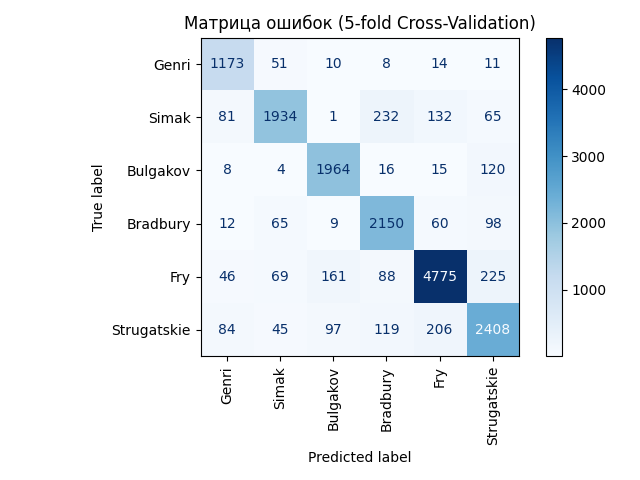
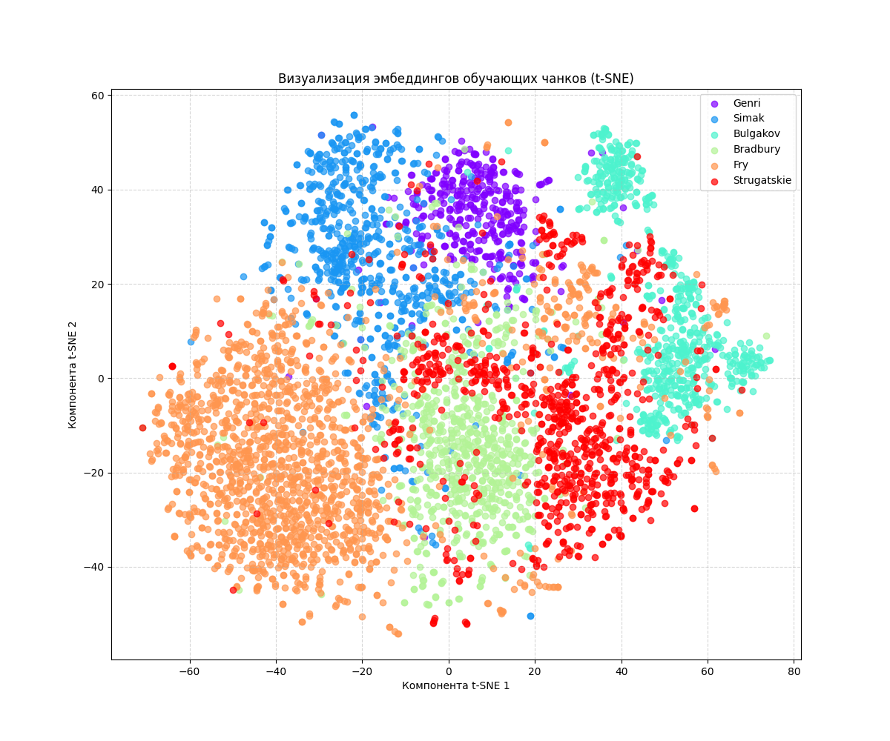

```markdown
# Определение автора текста с использованием SBERT и LinearSVC

## 1. Описание проблемы и постановка целей

**Проблема:** Атрибуция авторства текста — это задача определения наиболее вероятного автора для анонимного или спорного текстового фрагмента на основе стилистических особенностей письма. Это актуально в литературоведении, криминалистике и при модерации контента.

**Цель проекта:** Разработать и обучить модель машинного обучения, способную классифицировать фрагменты русскоязычных текстов по их авторам. В данном проекте рассматриваются тексты следующих авторов: Брэдбери, О. Генри, Саймак, Булгаков, Стругацкие, Фрай.

**Задачи:**
1.  Подготовить и предобработать текстовые данные (обучающие и тестовые).
2.  Выбрать и обосновать подход к векторизации текстов и модель классификации.
3.  Реализовать пайплайн для обучения модели, включая подбор гиперпараметров.
4.  Оценить качество модели на доступных данных.
5.  Сформировать файл с предсказаниями для тестового набора данных.
6.  Проанализировать результаты и предложить пути для дальнейшего улучшения.

## 2. Обоснование выбранного подхода и методов

### 2.1. Обработка данных

* **Исходные данные:** Тексты произведений 6 авторов в формате `.txt`, кодировка `UTF-8`. Отдельные файлы `author*.txt` для тестирования.
* **Предобработка:**
    * **Токенизация на предложения:** Используется библиотека `nltk` (`punkt` для русского языка) для корректного разделения текста на предложения. Это необходимо для последующего шага.
    * **Чанкинг (Chunking):** Обучающие тексты каждого автора делятся на небольшие фрагменты ("чанки"), состоящие из фиксированного числа предложений (`SENTENCES_PER_CHUNK`, по умолчанию 10).
        * *Обоснование:* Увеличивает количество обучающих примеров, что особенно полезно при ограниченном объеме исходных текстов. Позволяет модели улавливать локальные стилистические особенности. Уменьшает вычислительную нагрузку при генерации эмбеддингов по сравнению с обработкой очень длинных текстов целиком.
    * **Тестовые данные:** Обрабатываются целиком, без чанкинга, так как требуется сделать предсказание для всего предоставленного фрагмента.
* **Формирование выборок:** Создаются списки текстовых чанков (`train_texts`) и соответствующих им числовых ID авторов (`train_author_ids`). Тестовые тексты (`test_texts`) и их ID (`test_ids_sorted`) также подготавливаются.

### 2.2. Архитектура модели (Эмбеддинги + Классификатор)

Выбран двухэтапный подход:

1.  **Генерация Эмбеддингов (Векторизация):**
    * **Модель:** `sentence-transformers` с предобученной моделью `sberbank-ai/sbert_large_nlu_ru`. 
    * *Обоснование:* SBERT (Sentence-BERT) – это state-of-the-art подход для получения семантически насыщенных векторных представлений предложений и коротких текстов. Модель `sberbank-ai/sbert_large_nlu_ru` специально обучена на большом корпусе русскоязычных текстов и хорошо подходит для задач NLP на русском языке, включая улавливание стилистических нюансов. Эмбеддинги нормализуются (`normalize_embeddings=True`), что часто улучшает работу последующих метрических алгоритмов, таких как SVM.
2.  **Классификация:**
    * **Модель:** `sklearn.svm.LinearSVC` (Линейный метод опорных векторов).
    * *Обоснование:* SVM хорошо зарекомендовали себя в задачах классификации текстов, особенно при работе с высокоразмерными признаковыми пространствами (эмбеддингами). `LinearSVC` является эффективной реализацией для линейного случая. Использование `class_weight='balanced'` помогает бороться с возможным дисбалансом классов (разным количеством чанков от разных авторов).

### 2.3. Выбор гиперпараметров

* **`SENTENCES_PER_CHUNK`:** Установлено значение `10`. Этот параметр влияет на гранулярность анализа стиля и объем обучающей выборки. Его можно варьировать для поиска оптимального значения.
* **`LinearSVC`:**
    * **`C` (параметр регуляризации):** Подбирается автоматически с помощью `sklearn.model_selection.GridSearchCV`. Поиск осуществляется по сетке значений `[0.1, 1, 10, 100, 1000]`.
        * *Обоснование:* `GridSearchCV` позволяет найти оптимальное значение `C`, балансируя между точностью на обучающей выборке и обобщающей способностью модели, используя кросс-валидацию.
    * **Кросс-валидация:** Используется k-fold CV (`k` равно `min(5, min_samples_per_class)`), чтобы обеспечить надежную оценку качества модели при подборе `C` и избежать переобучения на конкретное разбиение данных.
    * **Другие параметры:** `max_iter=2000` для гарантии сходимости, `random_state=42` для воспроизводимости, `dual=True` для решения двойственной задачи оптимизации (обычно предпочтительно при большом количестве признаков).

## 3. Исходный код и ключевые этапы работы

### 3.1. Установка и зависимости

Для запуска кода необходимы следующие библиотеки:

* `pandas`
* `numpy`
* `scikit-learn`
* `sentence-transformers`
* `nltk`
* `torch` или `tensorflow` (как зависимость для `sentence-transformers`)
* `matplotlib` и `seaborn` для визуализации

Установить их можно с помощью pip:
```bash
pip install pandas numpy scikit-learn sentence-transformers nltk torch tensorflow
```

Также необходимо загрузить пакет `punkt` для `nltk`:
```python
import nltk
nltk.download('punkt')
```

### 3.2. Структура проекта (Пример)

```
WriterExtnd_sbert/
│
├── writerextnd/                                        # Папка с данными
│   ├── Bradbury.txt
│   ├── Genri.txt
│   ├── Simak.txt
│   ├── Bulgakov.txt
│   ├── Strugatskie.txt
│   ├── Fry.txt
│   └── author*.txt                                     # Тестовые файлы
│
├── writerextnd_bert_v2.ipynb                           # Jupyter Notebook с кодом
├── submission_sbert_chunked_gridsearch.csv             # Результирующий файл с предсказаниями
└── README.md                                           # Файл с описание проекта
```

### 3.3. Этапы выполнения (описание кода)

Полный исходный код с комментариями представлен в файле `[writerextnd_bert_v2.ipynb]`. Основные шаги:

1.  **Импорты и Настройки:** Загрузка библиотек, определение констант (имя модели SBERT, путь к данным, размер чанка), настройка словарей авторов и их ID.
2.  **Загрузка NLTK и Модели SBERT:** Проверка наличия пакета `punkt` и загрузка предобученной модели `sentence-transformers`.
3.  **Загрузка и Предобработка Обучающих Данных:** Чтение файлов авторов, разбиение на предложения (`nltk`), формирование чанков, создание списков `chunked_train_texts` и `chunked_train_author_ids`.
4.  **Загрузка Тестовых Данных:** Чтение файлов `author*.txt`, сохранение текстов и их ID (`test_data`, `test_ids_sorted`).
5.  **Генерация Эмбеддингов:** Преобразование обучающих чанков и тестовых текстов в векторы с помощью загруженной модели SBERT (`model_st.encode`).
6.  **Построение и Обучение Модели:**
    * Определение сетки `param_grid` для гиперпараметра `C`.
    * Настройка `GridSearchCV` с базовым классификатором `LinearSVC` и k-fold кросс-валидацией.
    * Обучение `GridSearchCV` на обучающих эмбеддингах (`grid_search.fit`).
    * Получение лучшего классификатора (`classifier = grid_search.best_estimator_`).
    * Обработка случая, когда кросс-валидация невозможна (слишком мало примеров у какого-либо класса).
7.  **Предсказание и Сохранение Результатов:**
    * Получение предсказаний для тестовых эмбеддингов (`classifier.predict`).
    * Формирование `pandas.DataFrame` с ID тестовых файлов и предсказанными ID авторов.
    * Сохранение DataFrame в файл `submission_sbert_chunked_gridsearch.csv`.

## 4. Результаты и анализ

### 4.1. Оценка модели (на кросс-валидации)

В результате работы `GridSearchCV` на обучающих чанках были получены следующие результаты:

* **Лучшее значение `C`:** `[10]`
* **Лучшая средняя точность (accuracy) на кросс-валидации (`k`-fold):** `[77%]`

*Важно:* Эта оценка получена на *обучающих данных* (чанках) в процессе кросс-валидации и служит для выбора гиперпараметров. Финальная оценка качества модели проводилась на [kaggle.com](https://www.kaggle.com/competitions/writerextnd/submissions).

Файл с предсказаниями `submission_sbert_chunked_gridsearch.csv` был загружен и оценен Kaggle. Результаты оценки:

* **Private Score:** 0.90909
* **Public Score:** 0.80000

Таким образом, финальная точность (accuracy) модели на тестовом задании составила **0.90909**.

### 4.2. Анализ результатов (примеры предсказаний)

Скрипт выводит примеры предсказаний для первых тестовых файлов:

```
    ID файла: author1  -> Предсказан ID: 0 (Автор: Genri)
    ID файла: author2  -> Предсказан ID: 1 (Автор: Simak)
    ID файла: author3  -> Предсказан ID: 0 (Автор: Genri)
    ID файла: author4  -> Предсказан ID: 2 (Автор: Bulgakov)
    ID файла: author5  -> Предсказан ID: 0 (Автор: Genri)
  ... (и так далее)
```
Итоговый файл `submission_sbert_chunked_gridsearch.csv` содержит полный список предсказаний для всех тестовых файлов.

### 4.3. Визуализации и анализ ошибок (на обучающих данных)

Для более глубокого понимания работы модели и ее ошибок, в основной скрипт ([writerextnd_bert_v2.ipynb]) был добавлен блок анализа. Этот анализ выполняется на **обучающих данных** с использованием предсказаний, полученных методом кросс-валидации (`cross_val_predict`). Такой подход дает более объективную оценку производительности на "невидимых" для каждой конкретной итерации модели данных по сравнению с оценкой на полном обучающем наборе.

Были реализованы и визуализированы следующие шаги анализа:

1.  **Матрица ошибок (Confusion Matrix):**
    * Была построена и визуализирована матрица ошибок на основе сопоставления истинных меток (`train_author_ids`) и предсказаний кросс-валидации (`y_pred_cv`).
    * Эта матрица наглядно показывает, сколько чанков каждого автора было классифицировано правильно (диагональные элементы) и какие авторы чаще всего путаются между собой (внедиагональные элементы). Это ключевой инструмент для выявления систематических ошибок модели.
      ```markdown
      
      ```

2.  **Визуализация эмбеддингов (t-SNE):**
    * Эмбеддинги SBERT для обучающих чанков (`train_embeddings`) были спроецированы в двумерное пространство с помощью алгоритма t-SNE (`sklearn.manifold.TSNE`). Это позволяет визуально представить сложные многомерные данные.
    * Был построен график рассеяния (scatter plot), где каждая точка соответствует одному текстовому чанку, а её цвет обозначает истинного автора.
    * Такая визуализация помогает оценить внутреннюю структуру данных и понять, насколько хорошо эмбеддинги сами по себе разделяют классы. Четко разделенные цветные кластеры указывают на хорошую работу SBERT для данной задачи, в то время как сильное смешение цветов может указывать на схожесть стилей авторов или недостаточное качество эмбеддингов для их различения.
      ```markdown
      
      ```

3.  **Анализ конкретных ошибок предсказаний:**
    * Скрипт автоматически находит примеры текстовых чанков из обучающей выборки, которые были неверно классифицированы во время кросс-валидации.
    * Несколько таких примеров выводятся в лог выполнения с указанием истинного автора, предсказанного автора и самого текста чанка.
    * Этот качественный анализ позволяет изучить конкретные случаи, где модель ошибается, и попытаться понять причины (например, короткий или стилистически неоднозначный текст, схожесть стилей авторов на определенных фрагментах).

Эти шаги анализа предоставляют ценную информацию о сильных и слабых сторонах обученной модели и результатах, полученных на этапе кросс-валидации обучающих данных. Они могут служить основой для дальнейших улучшений (см. раздел 5.2 "Рекомендации").

## 5. Выводы и рекомендации

### 5.1. Выводы

* Разработан пайплайн для решения задачи атрибуции авторства русскоязычных текстов.
* Подход, основанный на эмбеддингах SBERT (`sberbank-ai/sbert_large_nlu_ru`) и классификаторе `LinearSVC`, показал работоспособность и достиг точности `[77%]` на кросс-валидации обучающих данных.
* Техника чанкинга позволила эффективно использовать доступные текстовые данные для обучения.
* Подбор гиперпараметра `C` (лучшие пока 10) для `LinearSVC` с помощью `GridSearchCV` позволил оптимизировать модель.

### 5.2. Рекомендации по дальнейшему улучшению

* **Эксперименты с `SENTENCES_PER_CHUNK`:** Попробовать разные значения (меньше или больше 10) для определения оптимального размера текстового фрагмента.
* **Другие модели эмбеддингов:** Исследовать другие предобученные модели `sentence-transformers` (включая многоязычные или другие русскоязычные варианты) или даже подходы на основе TF-IDF в качестве бейзлайна.
* **Другие классификаторы:** Попробовать альтернативные модели поверх эмбеддингов SBERT: Logistic Regression, Random Forest, Gradient Boosting (XGBoost, LightGBM, CatBoost) или даже небольшие нейронные сети.
* **Валидация:** Если возможно, выделить отдельный валидационный набор данных (не участвующий в `GridSearchCV`) для финальной оценки модели и более надежной настройки гиперпараметров перед предсказанием на тесте.
* **Анализ ошибок:** Реализовать построение матрицы ошибок и детальный анализ текстов, на которых модель ошибается, для выявления слабых мест.
* **Предобработка:** Хотя SBERT часто устойчив к "шуму" в тексте, можно попробовать применить дополнительную очистку текста (удаление специфических символов, возможно, приведение к нижнему регистру, хотя для стиля это может быть важно).
* **Аугментация данных:** Рассмотреть техники аугментации текста, если это применимо к сохранению стиля (например, back-translation), для увеличения разнообразия обучающей выборки.
```